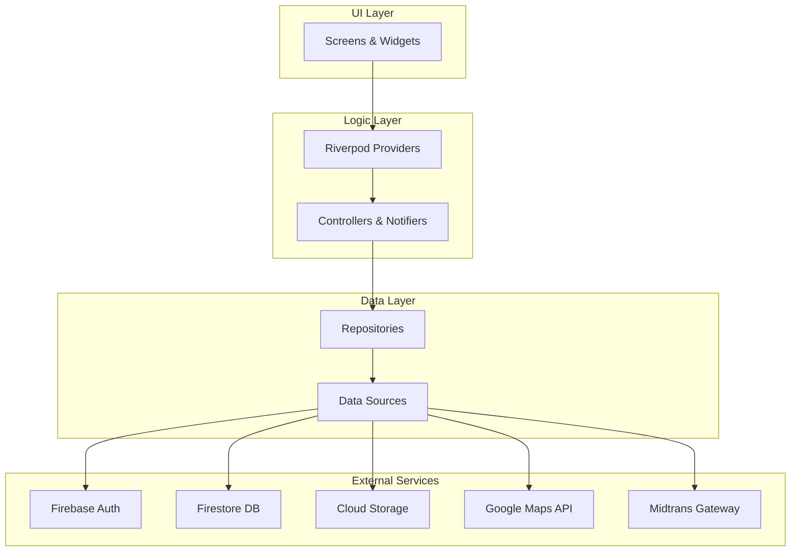

# VillaVibe


**VillaVibe** is a comprehensive vacation rental application built with Flutter, designed to provide a seamless experience for both Guests and Hosts. It features a unified platform where users can easily switch roles, book stunning villas, manage listings, and communicate in real-time.

---

## Table of Contents

- [App Showcase](#-app-showcase)
- [Key Features](#-key-features)
- [Architecture](#-architecture)
- [Tech Stack](#-tech-stack)
- [Project Structure](#-project-structure)
- [Getting Started](#-getting-started)
- [Roadmap](#-roadmap)
- [Contributing](#-contributing)
- [License](#-license)

---

## App Showcase

| Guest Home | Villa Details | Host Dashboard |
|:---:|:---:|:---:|
|  |  |  |
| **Explore Villas** | **Book Your Stay** | **Manage Listings** |

> *Note: Screenshots are placeholders. Please upload images to `assets/screenshots/`.*

---

## Key Features

### User Roles

| Feature | Guest | Host |
| :--- | :--- | :--- |
| **Dashboard** | Personalized recommendations, search, and trip history. | Performance stats, booking requests, and property management. |
| **Search** | Advanced filtering (location, price, amenities) & Map View. | N/A |
| **Bookings** | Real-time availability checks and secure payments. | Accept/Decline requests and manage calendar. |
| **Management** | Wishlists for saving favorite properties. | Create and edit villa listings with photos and details. |
| **Communication** | Chat with hosts for inquiries. | Chat with guests to coordinate stays. |

### Core Functionality

| Category | Description |
| :--- | :--- |
| **Authentication** | Secure sign-in via Email & Phone (OTP) using Firebase Auth. |
| **Dual-Role** | Single account architecture allowing seamless switching between Guest and Host modes. |
| **Payments** | Integrated secure payment gateway (Midtrans) for safe transactions. |

---

## Architecture

VillaVibe follows a **Feature-First** architecture with **Riverpod** for state management, ensuring separation of concerns and scalability.



---

## Tech Stack

| Category | Technology | Purpose |
| :--- | :--- | :--- |
| **Framework** | [Flutter](https://flutter.dev/) (Dart) | Cross-platform mobile development. |
| **State Management** | [Riverpod](https://riverpod.dev/) | Reactive state management with code generation. |
| **Navigation** | [GoRouter](https://pub.dev/packages/go_router) | Declarative routing and deep linking. |
| **Backend** | [Firebase](https://firebase.google.com/) | Auth, Firestore (Database), Storage, Cloud Functions. |
| **Maps** | Google Maps Flutter | Interactive maps and location services. |
| **Payments** | Midtrans | Secure payment processing. |
| **UI Utilities** | `flutter_animate`, `wolt_modal_sheet` | Smooth animations and modern modal sheets. |

---

## Project Structure

```text
lib/
├── core/                # Shared utilities, constants, and theme
├── features/            # Feature-specific code (The heart of the app)
│   ├── auth/            # Authentication (Login, Signup, User Model)
│   ├── bookings/        # Booking logic, history, and details
│   ├── favorites/       # Wishlist functionality
│   ├── guest/           # Guest-specific dashboard and profile
│   ├── home/            # Main landing screen and navigation
│   ├── host/            # Host dashboard, property management, stats
│   ├── messages/        # Chat and messaging system
│   ├── properties/      # Villa listings, details, and CRUD operations
│   └── search/          # Search logic, filters, and map view
├── main.dart            # Entry point
└── firebase_options.dart # Firebase configuration
```

---

## Getting Started

### Prerequisites

*   [Flutter SDK](https://docs.flutter.dev/get-started/install) (>=3.2.0)
*   [Firebase CLI](https://firebase.google.com/docs/cli)
*   Android Studio / Xcode for emulator and simulator support.

### Installation

1.  **Clone the repository**
    ```bash
    git clone https://github.com/yourusername/villavibe.git
    cd villavibe
    ```

2.  **Install dependencies**
    ```bash
    flutter pub get
    ```

3.  **Firebase Setup**
    Ensure you have the configuration files placed in their respective directories:
    *   `android/app/google-services.json`
    *   `ios/Runner/GoogleService-Info.plist`

4.  **Environment Configuration**
    This project uses API keys for Google Maps and other services. Ensure these are configured in your `AndroidManifest.xml` and `AppDelegate.swift`.

5.  **Run the App**
    ```bash
    flutter run
    ```

---

## Roadmap

- [x] **Core Features**: Authentication, Booking Flow, Host Dashboard.
- [x] **Payments**: Midtrans Integration.
- [ ] **Dark Mode**: Full support for dark theme.
- [ ] **Multi-language**: Localization for international users.
- [ ] **Advanced Analytics**: Deeper insights for Hosts.
- [ ] **Social Login**: Apple & Facebook Sign-in.

---

## Contributing

Contributions are welcome! Please follow these steps:

1.  Fork the repository.
2.  Create a new branch: `git checkout -b feature/amazing-feature`
3.  Make your changes and commit them: `git commit -m 'Add some amazing feature'`
4.  Push to the branch: `git push origin feature/amazing-feature`
5.  Open a Pull Request.

---

## License

This project is licensed under the MIT License - see the [LICENSE](LICENSE) file for details.
